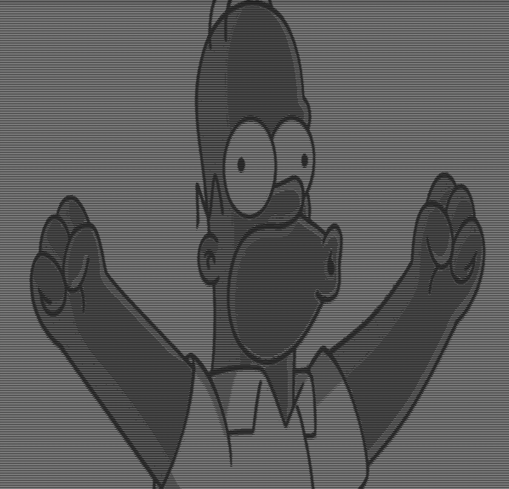
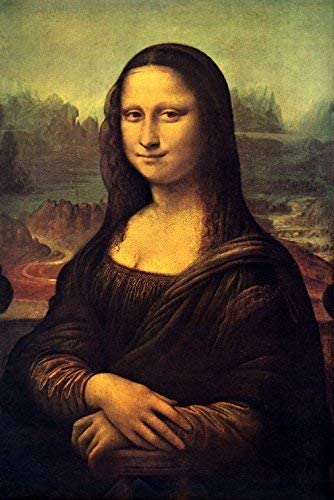

# Image-to-ascii
Convert images to ASCII art.

This program using [stb](https://github.com/nothings/stb) library to load images.

## Usage

```
    Usage:
    	compile the program to get *.out file
    	*.out [image]
    Parameters:
    	[image]   The image to convert. Supports many formats.
         
```

## Example

```
    Example:
        gcc img_to_ascii.c
        ./a.out images/monaliza.jpg
           	Your Image has been successfully converted to ASCII
		Path: "outs/monaliza.txt"
         - The program Load the image monaliza.jpg from the "images" directory.
         - After Loading the image, convert each pixel to gray value
	 - then put an ascii char that match the gray value grade in the txt file
	 
```
## Samples

simon.png            |  simon.txt
:-------------------------:|:-------------------------:
  |  

---

elon-musk.png            |  elon-musk.txt
:-------------------------:|:-------------------------:
  |  

---

monaliza.png            |  monaliza.txt
:-------------------------:|:-------------------------:
  |  
